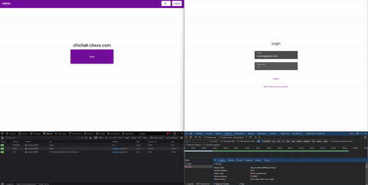
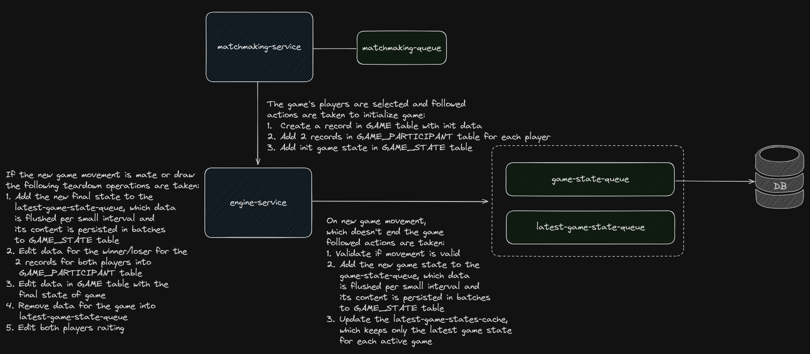
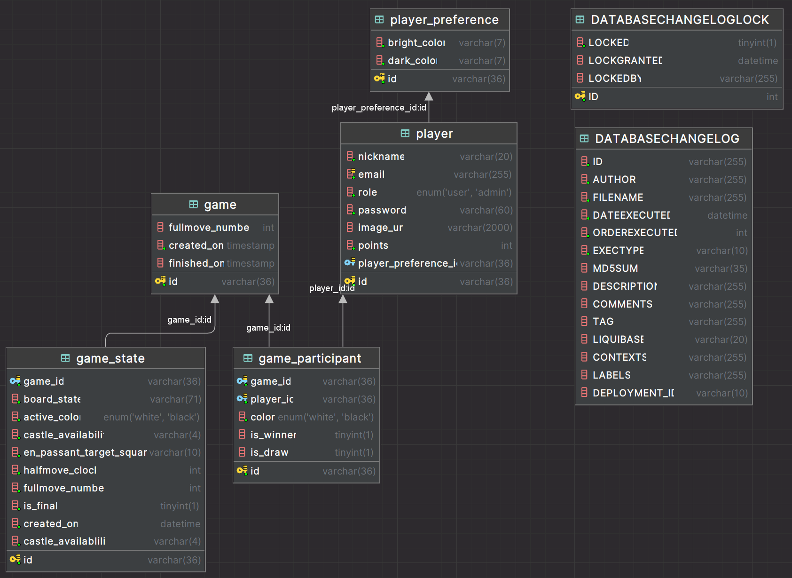
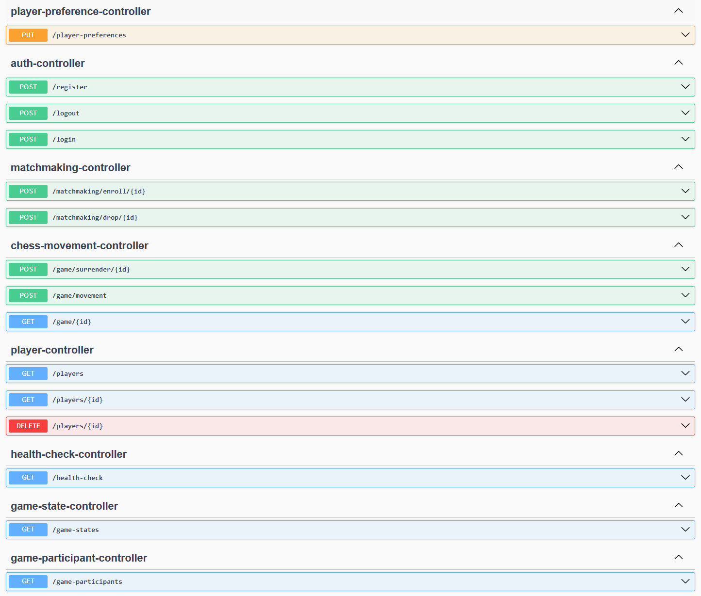

### Overview
You can find the frontend of the project [here](https://github.com/iypetrov/chichak-chess-client). It is not very user-friendly, but the main goal of this project is the API implementation.



This project is a small chess game platform where players can create accounts, join in matchmaking queues and if there is someone online they will both start a chess game.
Due to some difficulties with finding a working library for Angular that supports only chess board view
and represent board as a [FEN](https://en.wikipedia.org/wiki/Forsyth%E2%80%93Edwards_Notation) string I decided that
the players will enter in input field their movements and will see what is the board state by FEN string. 

### In-Depth Explanation
#### Game Flow

First things first - managing players. There is a standard authentication implementation in the application,
where users create a profile providing nickname, email and password(the password is stored in encrypted format).

When player logs in there is a simple view that shows metadata about player and his game history.

In the home view there is one button `Play`, where the fun begins. This is the entry point of game flow,
which is the main part in this API. When user hits the `Play` button this happens:
- User sends a request, which shows that he want to join in chess game. The request return response when an appropriate opponent is found.
This request will time out after 1 hour, if there is no other active player (Long Polling).
- What happens under the hood is that the player request is saved in in-memory queue and when new player joins we check if the queue has available players
and if so we check if players can compete with each other. Current "matchmaking" logic is simple - if there is a player in queue, create a new game with both players and clear the queue.

When we reach the point that we want 2 players to compete with each other there is a series of pre-game actions that are executed:
- We create a record in `GAME` table, with empty fullmove numbers (this will be set at the end of game with the numbers of turns that it took game to end)
and empty finishedOn field.
- We add 2 records in `GAME_PARTICIPANT` table, each for each player, that stores metadata about player participation in game -
with which color he plays and what is the final result of the game for him `win/lose/draw` (at the beginning everything is false)
- We add a initial game state for this game in `GAME_STATE`
- We fill up a local cache with:
  - Data about which player in which game is participating & for each game data which players are participating in. This data is not changed until the end of game,
  so it is very handy tо put in cache and whenever we need this data to get it from there, not to make separated database calls.
  - Data about the latest game state. This is very critical part of application, because the client makes a `GET` request every second to see if there is an update on the game state for particular game.
  Instead of making a database call for each HTTP call, we cache only the latest state and give the result based on the value in cache.

When some player makes a move we check if the movement is valid, if so:
- We update the latest state for the game.
- We send this new game state to an in-memory queue, where we store the game states that should be persisted. Per second we check if this queue has items in it,
and if so we make batch inserts to persist the states. We do this because there might be a lot of movements per second and in order not to create a huge
load on our database, we make a batch inserts, which is more efficient approach for writing in databases.

If the new movement ends or draws the game or a player surrenders these actions happens:
- We edit the data for end game into `GAME` and `GAME_PARTICIPANT` tables.
- We add the new final game state to the in-memory queue, where we store the game states that should be persisted (each second we persist the states from this queue).
- We clear information about the game from the in-memory cache.

#### Websockets vs Short & Long Polling
In this project the main reason to use Long Polling (for matchmaking) and Short Polling (for updating chess game state) is because
websockets requires additional set up and make the overall complexity higher. The chess game doesn't require real real time updates,
thats why I use long & short polling for this project. If timer is added in game, websocket implementation is required.

#### Problem With Cookies
As you can see on a lot of places the logic about getting the cookie from request and validate if the user has rights to do
this actions is commented, because I had a problem with sending the cookies from the Angular application (no problem with Postman), so
thats why I just commented them, but when this issue is resolved, I can uncomment these commented parts.

#### Database Schema

#### API Endpoints


#### What Would I Change If This Was A Real Product
- Change long & short polling with websocket implementation
- For matchmaking & game state queues would add a distributed cache (Redis) where I would keep the latest data.
On start up the API will load the latest data from Redis and per small interval (1 second) will batch insert it into Redis (if there is a new data
  in its local cache). On this way no data will be lost if the server shuts down (like in current implementation).
- Instead of using in-memory queue where I keep the states that should be persisted, will send them to a message queue (Kafka) topic.
On this way I guarantee that no information about game states will be lost. Also a separate service will be created that
only job will be to process and persist these states (this means that the only responsibility of the current service 
will be to send an event to the Kafka topic with the information about the new state). This new service can store the states
in a database that is better for storing of metric data (for relational database - TimescaleDB or for NoSQL - Cassandra).

### When You Run The API Locally
You should create a `.env` file in the project's root directory. This is example content:
```
API_MAJOR_VERSION=1
API_MINOR_VERSION=0
API_PATCH_VERSION=0
AUTH_SECRET=kdjaksdjaskdjlasdjaskldjaskldjaskfjfiafoasfoafpqfjpqwefoewfjoewfjeghsiogjgopsdgsdiog
DB_URL=jdbc:mysql://localhost:3306/chessdb
DB_USER=admin
DB_PASSWORD=admin
```